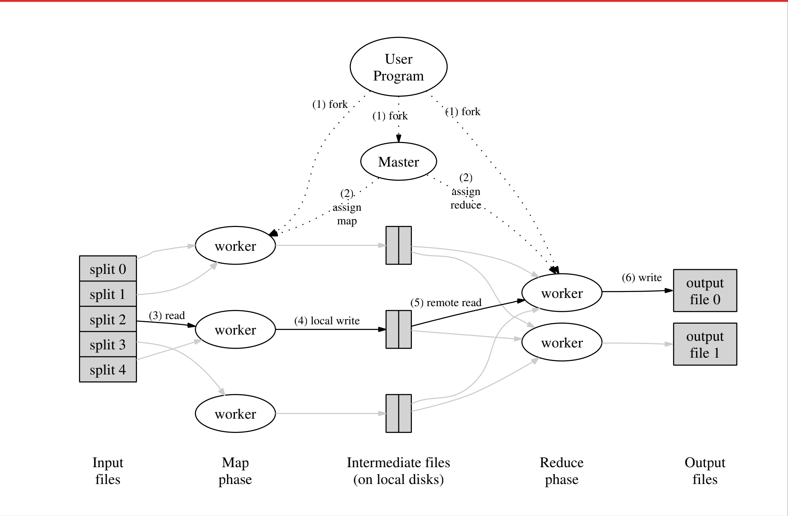

# 6.824 分布式系统

相关地址：[官方课程地址](https://pdos.csail.mit.edu/6.824/index.html)  [B站搬运课](https://www.bilibili.com/video/BV1qk4y197bB)

## MapReduce & lab1
### 基本理论与摘要

lab1需要用go 协程去实现一个分布式的mapreduce程序，已经给出了串行的情况。需要自己实现一下coordinator、worker、rpc三个组件，在src/mr下。

#### 串行MapReduce示例

示例程序在src/main/mrsequence.go 下，主要流程如下：

- 读取文件内容并调用map函数生成k-v形式的中间结果，k为单词字符串，v为1
- 按照K进行排序，相同的k会在排序中被划分到一起
- 找到相同的k的开始下标和结束下标，传递这个切片到reduce函数中
- reduce切片长度并返回，切片长度即单词出现的次数

上述流程对于单纯的统计字符串来说，有些冗杂。但是，其代表了一个通用的计算模型。

#### Lab1

在着手实现之前，需要通读一下论文部分。主要着重点在于第三章实现和第四章优化部分。由于需要进行复现，所以阅读的时候需要注意一下几点。

- Coordinator的职责是什么，保存怎样的数据结构，如何划分和监控任务的执行
- worker的职责是什么，保存怎样的数据接口
- worker和Coordinator之间如何进行RPC调用

> [MapReduce 论文地址](http://static.googleusercontent.com/media/research.google.com/zh-CN//archive/mapreduce-osdi04.pdf)

<strong> 集群环境 </strong>

- 依托于GFS提供全局的文件系统
- 大量廉价机器去做分布式计算，由于机器的不稳定性，需要考虑到容错的情况

<strong> MapReduce 程序运行的主要流程 </strong>

MapReduce主要流程如下：
1. 将输入的文件按照固定的大小SIZE进行划分，并Fork出多个进程，包含有Master和Worker
2. 根据用户指定的参数M & R 确定最终有M个Map任务以及R个Reduce任务，Master选择一个空闲的Worker去执行Map任务
3. worker进程读取指定的输入，并生产相应的KV中间结果，存储在内存中
4. 被缓存的KV中间结果会被周期性的写入磁盘，Master进程会存储其所在的位置，以便于后续分配Reduce任务
5. 当一个工作者被分配Reduce任务，它会通过远程过程调用去读取存储在Map进程本地的中间结果，当读取完所有的中间结果之后进行排序（这种排序的思想在数据库算子的设计中也非常的常见
6. 当Reduce迭代处理完所有的中间结果之后，根据每一个输入的独特的K生成相应的reduce产出的value，并追加到最终到输出文件
7. 所有任务处理完成，Master进程唤醒用户进程，继续执行

基本的原理是一样的，但是对于lab来说一些设计上需要有细微的不同。

Lab1主要流程梳理：
1. 启动Master进程，根据传入的文件名读取文件内容进入内存，创建Woker协程池，初始化Worker状态
2. 

**设计上的问题**
- 输入分区函数：Map函数需要将任务分发给多个不同的worker进程，那么任务的负载均衡是非常重要的，程序性能的下限取决于最晚执行的Map任务，另外最为糟糕的事情是，框架会kill掉执行时间过长掉任务（理由是可能是由于物理机的问题导致任务执行时间过长），并进行重新的调度。
  但若是由于框架本身的问题，带来的后果是无论重新调度多少次，该任务最终都会由于超时而执行失败。因此，如何平均分配任务到每一个worker是非常重要的。
  lab中的任务是需要读取文本文件，有一个问题在于如何按照固定大小进行划分导致摸个单词被分割开的情况该如何处理

- 协程池设计：协程池的大小如何设计？是否和M & R的大小有关？

<strong> Master 职责与保存的结构体 </strong>

<strong> Worker 职责与保存的结构体 </strong>

<!-- template -->
<!-- 

<strong>  </strong>

 -->

